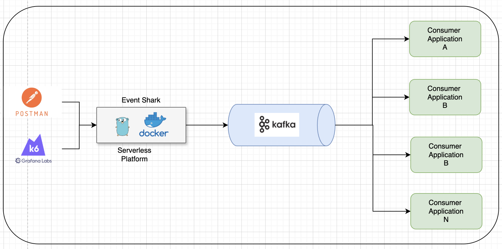

# Event Shark: A Serverless Kafka Event Publisher Testing Framework

* Accelerate your Kafka-driven development: Event Shark makes it easy to test consumer applications in isolation.
* Gain confidence in your consumer code: Simulate real-world publisher behavior for comprehensive testing.
* Optimize performance: Run targeted performance tests on consumer applications without complex publisher dependencies.

Event Shark is a Serverless framework which fill in the gap for kafka event publisher by exposing the eventing as simple json request.
Using this the consumer applcations can simulate the publisher behaviour and test their systems independently, not just the integration testing this can also help to run the performance testing for the consumer driven applications.
