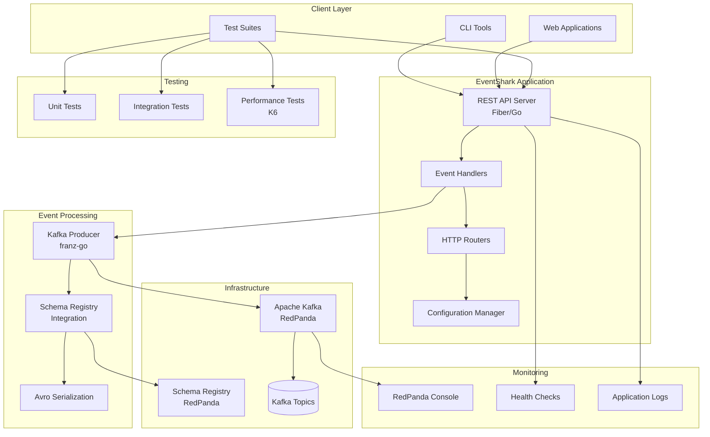
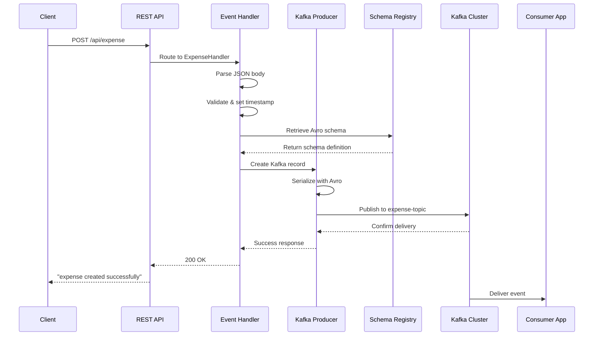
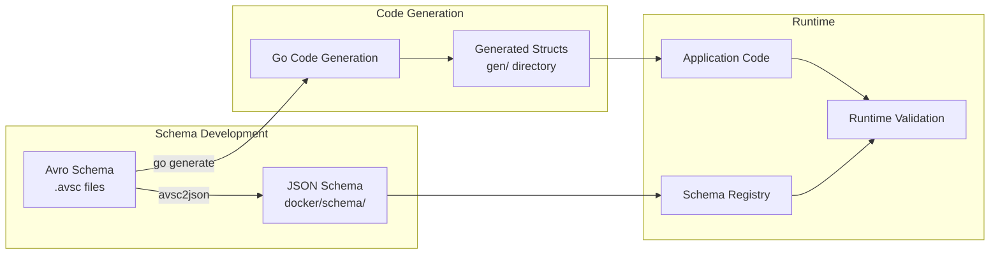
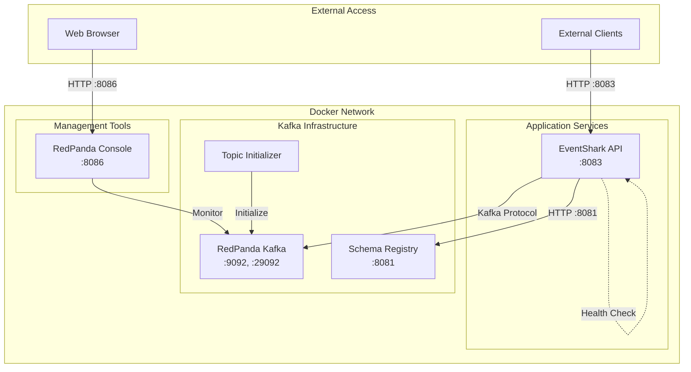
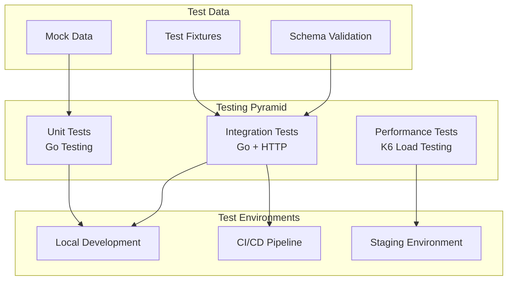

# EventShark Architecture Documentation

## Table of Contents
1. [Overview](#overview)
2. [System Architecture](#system-architecture)
3. [Component Architecture](#component-architecture)
4. [Data Flow](#data-flow)
5. [Event Schema Management](#event-schema-management)
6. [Deployment Architecture](#deployment-architecture)
7. [API Endpoints](#api-endpoints)
8. [Testing Strategy](#testing-strategy)
9. [Monitoring and Health Checks](#monitoring-and-health-checks)
10. [Technology Stack](#technology-stack)

## Overview

EventShark is a serverless Kafka event publishing testing framework designed to accelerate Kafka-driven development by enabling isolated testing of consumer applications. The system exposes Kafka event publishing capabilities through simple REST API endpoints, allowing developers to simulate real-world publisher behavior without complex dependencies.

### Key Benefits
- **Isolation Testing**: Test consumer applications independently from publishers
- **Schema Validation**: Ensure data consistency with Avro schema validation
- **Performance Testing**: Built-in performance testing capabilities
- **Easy Integration**: Simple REST API interface for event publishing

## System Architecture



## Component Architecture

### Core Components

#### 1. REST API Server (Fiber/Go)
- **Purpose**: HTTP server handling incoming requests
- **Framework**: GoFiber with JSON serialization
- **Features**:
  - CORS middleware for cross-origin requests
  - Security headers via Helmet middleware
  - Request logging with custom format
  - Graceful shutdown handling
  - Health check endpoint (`/health`)

#### 2. Event Handlers
- **ExpenseHandler**: Processes expense event creation requests
- **PaymentHandler**: Processes payment event creation requests
- **Features**:
  - JSON request body parsing
  - Automatic timestamp assignment
  - Avro schema validation
  - Kafka record creation and publishing

#### 3. Kafka Producer Client
- **Library**: franz-go (high-performance Kafka client)
- **Capabilities**:
  - Synchronous message production
  - Schema registry integration
  - Avro serialization/deserialization
  - Connection management and error handling

#### 4. Configuration Management
- **Environment-based configuration**
- **Configurable parameters**:
  - Kafka brokers (`BROKERS`)
  - Topic names (`TOPICS`)
  - Schema registry URL (`SCHEMAREGISTRY`)

### Generated Components

#### 5. Schema-Generated Code
- **Auto-generated Go structs** from Avro schemas
- **Current entities**:
  - `Expense`: Financial expense tracking
  - `Payment`: Payment transaction processing
  - `Transaction`: General transaction records
  - `Order`: Order management records

## Data Flow

### Event Publishing Workflow



### Schema Management Workflow



## Event Schema Management

### Avro Schema Strategy
The system uses Apache Avro for schema definition and evolution:

#### 1. Schema Definition
- **Location**: `schema/avro/*.avsc`
- **Format**: JSON-based Avro schema definition
- **Versioning**: Schema evolution supported through registry

#### 2. Schema Registry Integration
- **Provider**: RedPanda Schema Registry
- **Subject Naming**: `{topic-name}-value`
- **Evolution**: Backward compatibility maintained

#### 3. Code Generation
- **Tool**: Custom generator in `schema/avro/gen.go`
- **Output**: Go structs in `gen/` directory
- **Build Integration**: `make code-gen` command

### Current Schemas

#### Expense Schema
```json
{
  "type": "record",
  "namespace": "com.expense",
  "name": "Expense",
  "fields": [
    {"name": "expense_id", "type": "string"},
    {"name": "user_id", "type": "string"},
    {"name": "category", "type": "string"},
    {"name": "amount", "type": "double"},
    {"name": "currency", "type": "string"},
    {"name": "timestamp", "type": "long", "logicalType": "timestamp-millis"},
    {"name": "description", "type": ["null", "string"], "default": null},
    {"name": "receipt", "type": ["null", "string"], "default": null}
  ]
}
```

#### Payment Schema
```json
{
  "type": "record", 
  "namespace": "com.payment",
  "name": "Payment",
  "fields": [
    {"name": "transaction_id", "type": "string"},
    {"name": "user_id", "type": "string"},
    {"name": "amount", "type": "double"},
    {"name": "currency", "type": "string"},
    {"name": "payment_method", "type": "string"},
    {"name": "timestamp", "type": "long", "logicalType": "timestamp-millis"},
    {"name": "status", "type": {"name": "Status", "type": "enum", 
      "symbols": ["INITIATED", "PROCESSED", "COMPLETED", "FAILED"]}}
  ]
}
```

## Deployment Architecture

### Docker Compose Setup



### Service Dependencies
1. **Kafka**: RedPanda broker with multiple listeners
2. **Schema Registry**: Integrated with RedPanda
3. **Topic Initialization**: Automated topic creation
4. **EventShark API**: Depends on Kafka and Schema Registry
5. **Console**: Web UI for Kafka monitoring

### Port Mapping
- **8083**: EventShark REST API
- **9092**: Kafka external access
- **29092**: Kafka internal access
- **8081**: Schema Registry
- **8086**: RedPanda Console UI

## API Endpoints

### Core Endpoints

#### Health Check
```http
GET /health
Response: "healthy"
```

#### Expense Event Publishing
```http
POST /api/expense
Content-Type: application/json

{
  "expense_id": "exp_001",
  "user_id": "user_123",
  "category": "travel",
  "amount": 150.50,
  "currency": "USD",
  "description": "Conference travel expense",
  "receipt": "receipt_url"
}
```

#### Payment Event Publishing  
```http
POST /api/payment
Content-Type: application/json

{
  "transaction_id": "txn_001",
  "user_id": "user_123", 
  "amount": 99.99,
  "currency": "USD",
  "payment_method": "credit_card",
  "status": "COMPLETED"
}
```

### Response Format
- **Success**: `200 OK` with confirmation message
- **Error**: Appropriate HTTP status code with error details

## Testing Strategy

### Multi-layered Testing Approach



#### 1. Unit Tests
- **Framework**: Go testing package
- **Coverage**: Individual component functionality
- **Execution**: `go test ./...`

#### 2. Integration Tests
- **Tag**: `//go:build integration`
- **Scope**: End-to-end API testing
- **Requirements**: Running EventShark instance
- **Validation**: HTTP responses and Kafka message delivery

#### 3. Performance Tests
- **Tool**: K6 load testing framework
- **Location**: `tests/performance/`
- **Metrics**: Throughput, latency, error rates
- **Execution**: `npm test` or `k6 run tests/perf.js`

### Test Execution
```bash
# Unit tests
make test

# Integration tests (requires running services)
docker compose up -d
go test ./... -v --tags=integration

# Performance tests
cd tests/performance
npm test
```

## Monitoring and Health Checks

### Application Monitoring
- **Health Endpoint**: `/health` for readiness checks
- **Graceful Shutdown**: Signal handling for clean termination
- **Request Logging**: Structured logging with timestamps
- **Error Handling**: Comprehensive error reporting

### Infrastructure Monitoring
- **RedPanda Console**: Web-based Kafka cluster monitoring
- **Docker Health Checks**: Container health validation
- **Topic Monitoring**: Message flow and consumer lag tracking

### Logging Strategy
- **Format**: Structured logging with color coding
- **Information**: Request method, path, status, timestamp
- **Time Zone**: UTC for consistency
- **Output**: Standard output for container environments

## Technology Stack

### Backend Framework
- **Language**: Go 1.21+
- **Web Framework**: GoFiber v2
- **JSON Processing**: goccy/go-json (high performance)

### Kafka Integration
- **Client Library**: franz-go (modern Kafka client)
- **Schema Registry**: RedPanda compatible
- **Serialization**: Apache Avro with hamba/avro

### Infrastructure
- **Message Broker**: RedPanda (Kafka-compatible)
- **Schema Registry**: RedPanda Schema Registry
- **Containerization**: Docker & Docker Compose
- **Service Discovery**: Docker networking

### Development Tools
- **Dependency Management**: Go modules
- **Code Generation**: go generate with custom tools
- **Build System**: Make with defined targets
- **Testing**: Go testing + K6 performance testing

### Monitoring & Operations
- **Web UI**: RedPanda Console
- **Health Checks**: HTTP endpoint monitoring
- **Logging**: Structured application logging
- **Process Management**: Graceful shutdown handling

## Build and Deployment

### Local Development
```bash
# Start infrastructure
make build

# Run tests
make test

# Generate code from schemas  
make code-gen

# Convert schemas to JSON
make schema-gen

# Clean environment
make clean
```

### Production Considerations
- **Environment Variables**: Configure via environment
- **Resource Limits**: Set appropriate container limits
- **Network Security**: Implement proper network policies
- **Backup Strategy**: Consider topic data retention policies
- **Scaling**: Horizontal scaling through load balancing

This architecture provides a robust, scalable foundation for Kafka event publishing testing while maintaining simplicity and developer productivity.
