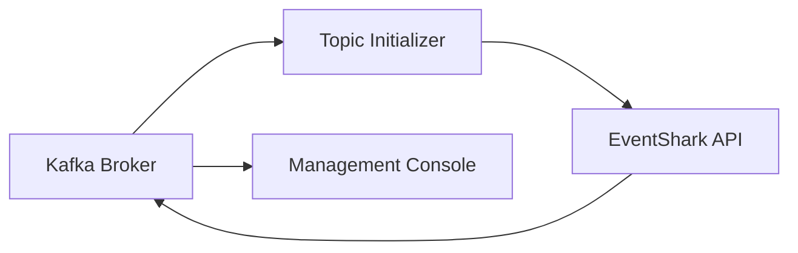

# EventShark Technical Analysis Summary

## Executive Summary

EventShark is a sophisticated serverless Kafka event publishing testing framework built in Go. The system provides a REST API interface for publishing events to Apache Kafka, enabling isolated testing of consumer applications without complex publisher dependencies. This analysis covers the complete architecture, workflows, and technical implementation.

## Architecture Overview

### Core Design Principles
- **Serverless Architecture**: Stateless API server with external Kafka infrastructure
- **Schema-First Design**: Avro schemas drive both data validation and code generation
- **Event-Driven Architecture**: Asynchronous message publishing with reliable delivery
- **Container-First Deployment**: Docker-based deployment with compose orchestration
- **Testing-Focused**: Built-in support for unit, integration, and performance testing

### System Components

#### 1. Application Layer
- **Technology**: Go with GoFiber web framework
- **Port**: 8083 (HTTP REST API)
- **Features**: CORS, security headers, request logging, graceful shutdown
- **Endpoints**: Health check, expense events, payment events

#### 2. Event Processing Layer  
- **Kafka Client**: franz-go (high-performance Go Kafka client)
- **Serialization**: Apache Avro with schema registry integration
- **Schema Management**: RedPanda Schema Registry for schema evolution
- **Error Handling**: Comprehensive error handling with logging

#### 3. Infrastructure Layer
- **Message Broker**: RedPanda (Kafka-compatible)
- **Schema Registry**: RedPanda Schema Registry
- **Management UI**: RedPanda Console for monitoring
- **Topics**: expense-topic, payment-topic, transaction-topic

## Technical Implementation

### Code Structure Analysis

```
EventShark/
├── cmd/main.go                 # Application entry point with Fiber setup
├── pkg/
│   ├── config/                # Environment-based configuration
│   ├── events/                # Kafka producer and schema handling
│   ├── handler/               # HTTP request handlers
│   └── router/                # HTTP route definitions
├── gen/                       # Auto-generated Go structs from Avro
├── schema/avro/               # Avro schema definitions
├── tests/                     # Multi-tier testing framework
└── docker/                    # Container configuration and scripts
```

### Key Technical Features

#### Schema Management
- **Avro Schema Evolution**: Backward-compatible schema changes
- **Code Generation**: Automatic Go struct generation from schemas
- **Runtime Validation**: Schema registry integration for validation
- **Version Management**: Schema versioning with compatibility checks

#### Event Publishing Workflow
1. **HTTP Request Reception**: GoFiber handles incoming JSON requests
2. **Input Validation**: JSON unmarshaling with struct validation
3. **Data Enrichment**: Automatic timestamp assignment
4. **Schema Retrieval**: Fetch Avro schema from registry
5. **Serialization**: Avro binary serialization
6. **Kafka Publishing**: Synchronous message production
7. **Response Handling**: Confirmation with offset information

#### Error Handling Strategy
- **Input Validation**: 400 Bad Request for malformed JSON
- **Schema Errors**: 500 Internal Server Error for schema issues
- **Kafka Errors**: 500 Internal Server Error for publishing failures
- **Comprehensive Logging**: Structured logging for debugging

## Data Model Analysis

### Event Schemas

#### Expense Event
```json
{
  "expense_id": "string",      // Unique identifier
  "user_id": "string",         // User reference
  "category": "string",        // Expense category
  "amount": "double",          // Monetary amount
  "currency": "string",        // Currency code
  "timestamp": "long",         // Unix timestamp (millis)
  "description": "string?",    // Optional description
  "receipt": "string?"         // Optional receipt URL
}
```

#### Payment Event
```json
{
  "transaction_id": "string",  // Transaction identifier
  "user_id": "string",         // User reference
  "amount": "double",          // Payment amount
  "currency": "string",        // Currency code
  "payment_method": "string",  // Payment method
  "timestamp": "long",         // Unix timestamp (millis)
  "status": "enum"            // INITIATED|PROCESSED|COMPLETED|FAILED
}
```

### Schema Evolution Support
- **Optional Fields**: New fields can be added as optional
- **Default Values**: Backward compatibility through defaults
- **Enum Extensions**: Status enums can be extended
- **Field Deprecation**: Graceful field removal process

## Performance Characteristics

### Throughput Capabilities
- **Synchronous Publishing**: Immediate confirmation of message delivery
- **High-Performance Client**: franz-go optimized for throughput
- **Concurrent Handling**: GoFiber's lightweight goroutine model
- **Schema Caching**: Schema registry responses cached for performance

### Scalability Features
- **Stateless Design**: Horizontal scaling through load balancing
- **Kafka Partitioning**: Topic partitioning for parallel processing
- **Connection Pooling**: Efficient Kafka connection management
- **Resource Efficiency**: Minimal memory footprint

## Testing Framework

### Multi-Tier Testing Strategy

#### Unit Tests
- **Package-Level Testing**: Individual component validation
- **Mock Dependencies**: Isolated testing with mocks
- **Code Coverage**: Comprehensive test coverage
- **Fast Execution**: Rapid feedback for developers

#### Integration Tests
- **End-to-End Validation**: Full request-response cycle
- **Kafka Integration**: Actual message publishing verification
- **Schema Validation**: Real schema registry interaction
- **Build Tag Isolation**: `//go:build integration`

#### Performance Tests
- **Load Testing**: K6-based performance validation
- **Throughput Measurement**: Messages per second metrics
- **Latency Analysis**: Response time distribution
- **Resource Monitoring**: CPU and memory usage tracking

## Deployment Architecture

### Container Strategy
- **Multi-Service Compose**: Orchestrated service deployment
- **Dependency Management**: Proper service startup ordering
- **Health Checks**: Container health validation
- **Volume Management**: Persistent data storage

### Service Dependencies


### Port Configuration
- **8083**: EventShark REST API
- **9092**: Kafka external access
- **29092**: Kafka internal access  
- **8081**: Schema Registry
- **8086**: RedPanda Console UI

## Operational Considerations

### Monitoring and Observability
- **Health Endpoints**: Application health validation
- **Structured Logging**: JSON-formatted application logs
- **Metrics Collection**: Performance metrics gathering
- **Management UI**: RedPanda Console for Kafka monitoring

### Configuration Management
- **Environment Variables**: Runtime configuration via env vars
- **Default Values**: Sensible defaults for development
- **Validation**: Configuration validation at startup
- **Documentation**: Clear configuration documentation

### Security Features
- **CORS Protection**: Cross-origin request security
- **Security Headers**: Helmet middleware for security
- **Input Validation**: Comprehensive input sanitization
- **Schema Validation**: Data integrity through schemas

## Development Workflow

### Code Generation Pipeline
1. **Schema Definition**: Create/modify Avro schemas
2. **Struct Generation**: Run `make code-gen` for Go structs
3. **Schema Conversion**: Convert AVSC to JSON for registry
4. **Application Update**: Update handlers for new fields
5. **Testing**: Validate changes with test suite

### Build and Deployment Process
```bash
# Development cycle
make code-gen      # Generate Go code from schemas
make schema-gen    # Convert schemas to JSON
make build         # Start infrastructure
make test          # Run test suite
make clean         # Clean environment
```

## Future Enhancement Opportunities

### Scalability Improvements
- **Async Publishing**: Optional asynchronous mode for higher throughput
- **Batch Publishing**: Multiple events in single request
- **Compression**: Message compression for bandwidth efficiency
- **Connection Pooling**: Advanced connection management

### Feature Extensions
- **Authentication**: API key or JWT-based authentication
- **Rate Limiting**: Request rate limiting for stability
- **Multiple Formats**: Support for JSON, Protobuf alongside Avro
- **Dead Letter Queues**: Failed message handling

### Operational Enhancements
- **Metrics Endpoint**: Prometheus-compatible metrics
- **Distributed Tracing**: Request tracing across services
- **Circuit Breaker**: Fault tolerance patterns
- **Configuration Reload**: Hot configuration reloading

## Conclusion

EventShark represents a well-architected, production-ready solution for Kafka event publishing testing. The system demonstrates:

- **Strong Engineering Practices**: Comprehensive testing, clear separation of concerns
- **Modern Technology Stack**: Go, Fiber, RedPanda, Docker
- **Scalable Architecture**: Stateless design with horizontal scaling capability
- **Developer Experience**: Easy setup, clear documentation, comprehensive tooling

The codebase is well-structured, follows Go best practices, and provides a solid foundation for Kafka-based event testing scenarios. The schema-first approach ensures data consistency while enabling evolution, and the comprehensive testing framework provides confidence in system reliability.

### Recommended Next Steps
1. **Production Hardening**: Add authentication, rate limiting, and monitoring
2. **Performance Optimization**: Implement batch processing and async modes
3. **Documentation Enhancement**: API documentation with OpenAPI/Swagger
4. **CI/CD Integration**: Automated testing and deployment pipelines
5. **Monitoring Enhancement**: Metrics collection and alerting setup
