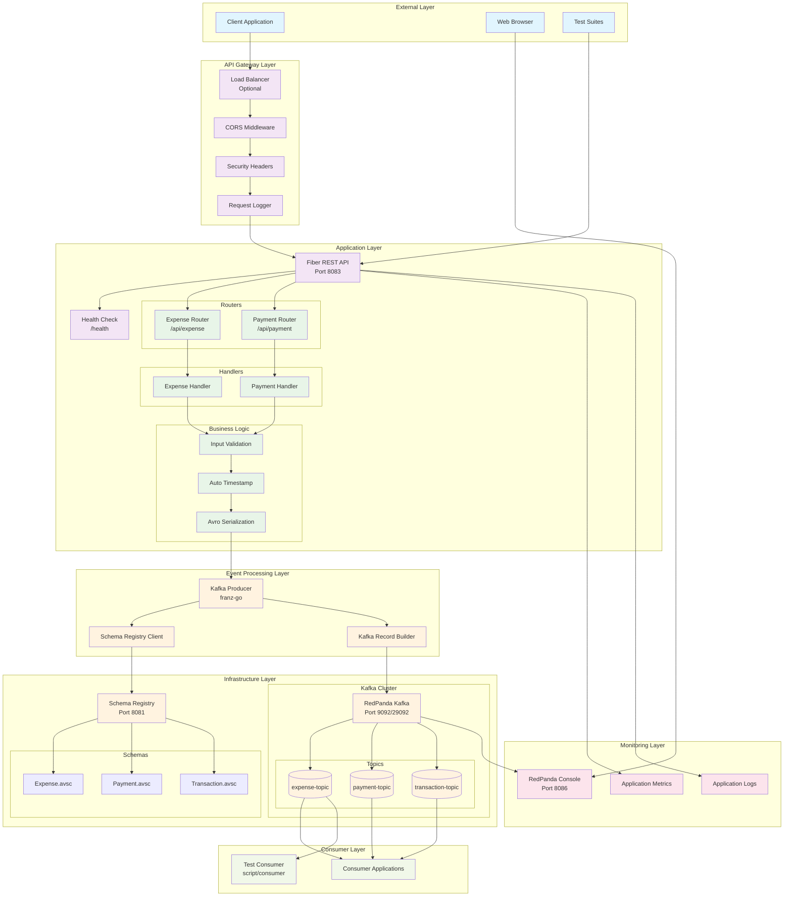
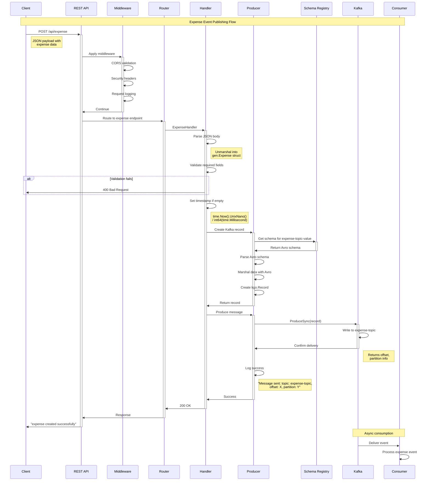
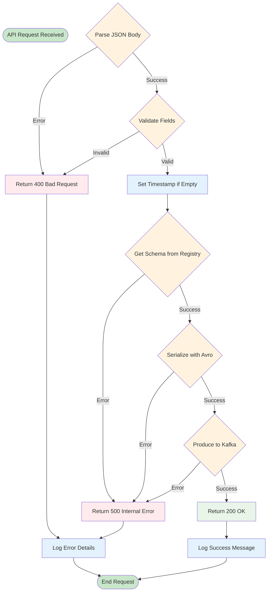
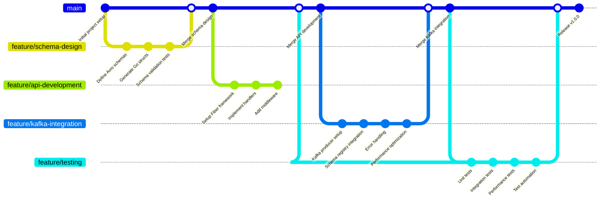
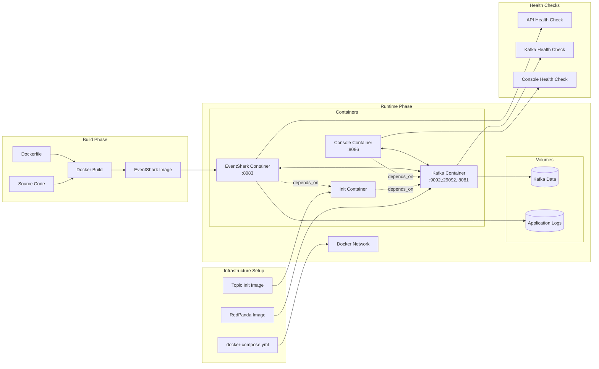
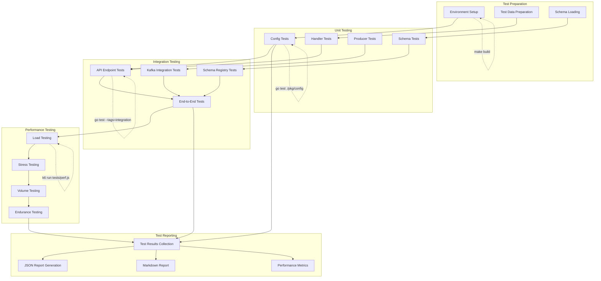
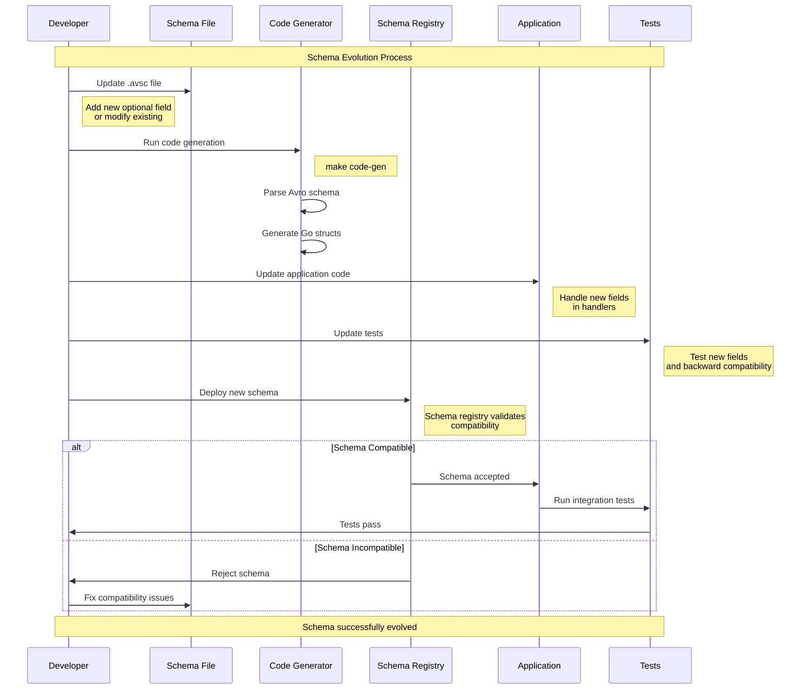

# EventShark Workflow Diagrams

This document contains detailed workflow diagrams for the EventShark system, showing the complete flow from API request to Kafka message delivery.

## Complete System Workflow

## Request Processing Workflow

## Error Handling Workflow

## Development Workflow

## Docker Container Workflow

## Testing Workflow

## Schema Evolution Workflow

This workflow documentation provides comprehensive visual representations of how EventShark operates at different levels, from high-level system architecture to detailed request processing flows.
